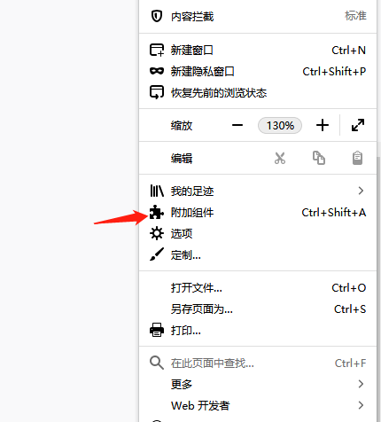
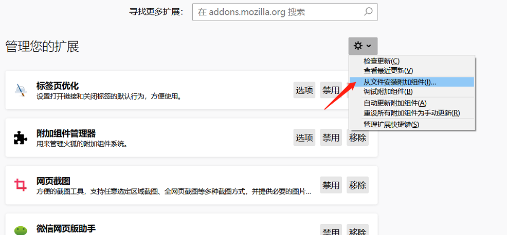
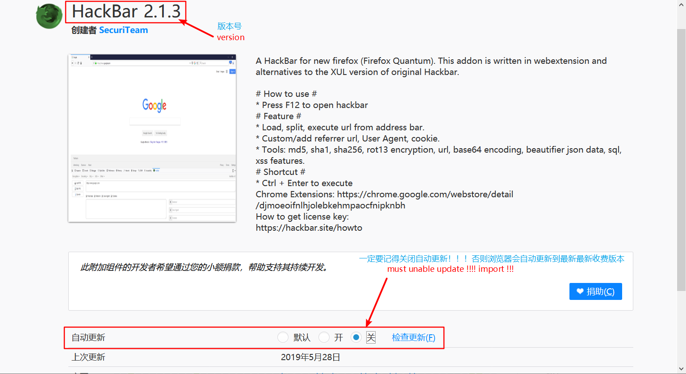

* # hackbar2.1.3
* firefox hackbar收费前的残留版本 
使用方法 
打开firefox的插件目录 

* 然后点这里
 

 
加载{4c98c9c7-fc13-4622-b08a-a18923469c1c}.xpi  即可

* ### 一定记住要关闭插件的自动更新！！！，否则浏览器会自动更新插件到收费版本！！!  
* 设置方法如下图所示: 

* PS: 插件来源于:  
这里: https://github.com/HCTYMFF/hackbar2.1.3